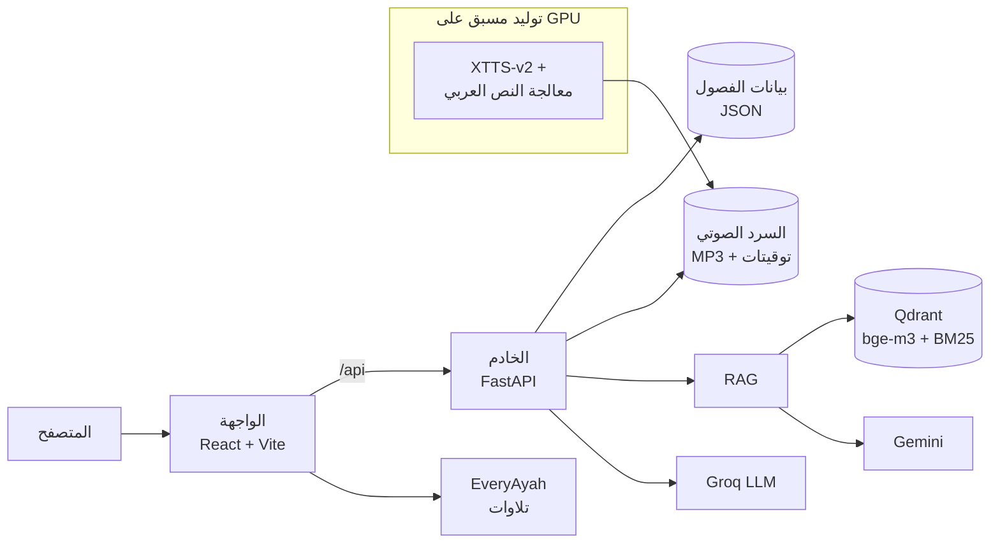

<div align="center">

# دَرْب السيرة

**رحلة تفاعلية لاكتشاف السيرة النبوية: من حدث إلى حكاية، ومن حكاية إلى درس، ومن درس إلى أثر**

[](https://darb-alseerah.onrender.com)


</div>

> **للتجربة مباشرة:** https://darb-alseerah.onrender.com
> الاستضافة مجانية وتدخل في وضع السكون عند عدم الاستخدام، فقد يستغرق أول فتح حوالي دقيقة.

---

## نظرة عامة

يقدّم **دَرْب السيرة** السيرة النبوية (من كتاب *الرحيق المختوم*) كرحلة معرفية مترابطة بدل نص طويل يُقرأ خطيًّا. يبدأ المستخدم من خريطة لفصول السيرة الـ34، ويتنقّل بين أحداثها الـ417 مرتبةً زمنيًا، فيقرأ أو **يستمع** لكل حدث، ويسأل عنه مساعدًا ذكيًا **يجيب من المصادر الموثوقة فقط**، ثم يختبر فهمه.

**المشكلة التي يعالجها:** المتعلم الجديد لا يعرف من أين يبدأ، ويصعب عليه فهم تسلسل الأحداث والربط بينها، ويتعامل مع محتوى طويل ومتفرق. **الحل:** محتوى موثوق + تجربة تفاعلية + ذكاء اصطناعي منضبط بالمصادر.

## المزايا

| الميزة | الوصف |
|---|---|
| 🗺️ **خريطة الرحلة** | 34 فصلًا مرتبة زمنيًا، مع تتبع التقدم وسلسلة الأيام المتتالية |
| 📖 **قارئ الأحداث** | نص كل حدث مع التنقل بين الأحداث، والتبديل بين النص الأصلي والصياغة القصصية، وثلاثة مظاهر للقراءة |
| 🎧 **السرد الصوتي** | زر «استمع إلى الحدث» لكل الأحداث، بصوت راوٍ يولّده الذكاء الاصطناعي، مع إبراز الجملة المسموعة |
| 🕋 **التلاوة البشرية** | الآيات لا يقرؤها الذكاء الاصطناعي أبدًا؛ تُشغَّل تلاوة الشيخ مشاري العفاسي في موضعها |
| 💬 **المساعد «دَالّ»** | يجيب عن الأسئلة من مصادر السيرة المفهرسة مع ذكر المصدر، ويمتنع عند عدم الثقة |
| ✅ **تحقق من فهمي** | يكتب المستخدم ما فهمه من الحدث، فيقيّمه الذكاء الاصطناعي ويوجهه |
| 📝 **اختبارات ودروس** | دروس مستفادة واختبار لكل فصل |
| 📍 **أين نحن على الخريطة** | فتح موقع الحدث الجغرافي على خرائط Google |

## البنية المعمارية



خادم واحد يقدّم الموقع والـ API وملفات الصوت والمساعد من **رابط واحد**. السرد الصوتي **يُولَّد مسبقًا** للكتاب كاملًا، فالتطبيق لا يحتاج GPU أثناء التشغيل.

## الذكاء الاصطناعي في المشروع

### 1. السرد الصوتي (TTS)
- **النموذج:** XTTS-v2، نموذج عصبي متعدد اللغات يدعم العربية الفصحى، مع **بث لحظي** واستنساخ صوتي من مقطع قصير.
- **معالجة النص العربي:** تقسيم ذكي للجمل، وتطبيع (ﷺ ← صلى الله عليه وسلم)، ومعجم نطق للأعلام والأماكن (أُحُد، العَقَبَة)، وحذف المراجع والإحالات.
- **حماية النص القرآني:** تُكتشف الآيات وتُعزل، ثم **يُتعرّف عليها من نصها** بمطابقته مع المصحف الكامل (6,236 آية من Tanzil) لتشغيل التلاوة الصحيحة، حتى لو غاب المرجع.
- **وضعان:** توليد مسبق للكتاب كاملًا (المستخدم في التطبيق)، وبث لحظي عبر WebSocket أثناء كتابة نموذج اللغة.

### 2. المساعد «دَالّ» (RAG)
- **بحث هجين:** متجهات دلالية (`BAAI/bge-m3`) + بحث بالكلمات (BM25) في Qdrant، مدموجة بـ RRF.
- **الامتناع عند عدم الثقة:** إن لم يتجاوز أي مصدر حد التشابه، لا يخمّن.
- **توليد مقيّد بالمصادر:** Gemini يجيب من النصوص المسترجعة فقط، مع استشهادات `[1]` تظهر مصادرها أسفل الإجابة.
- **وعي بالسياق:** يعرف الحدث أو الفصل الذي يقرؤه المستخدم.
- **احتياط:** إن لم توجد الإجابة في المصادر أو تعطلت الخدمة، يجيب مساعد أساسي من نص الحدث المعروض فقط.

### 3. توليد المحتوى التعليمي وتقييم الفهم
- مقدمات الفصول والدروس والاختبارات مولّدة بنموذج لغوي (Groq) من نص الكتاب.
- «تحقق من فهمي» يقيّم تلخيص المستخدم للحدث مقارنةً بنصه.

## المقاييس

| المقياس | النتيجة |
|---|---|
| زمن أول صوت في البث اللحظي | **0.69 ثانية** (GPU من نوع T4) |
| سرعة توليد الصوت | **1.7–1.9×** أسرع من زمن الاستماع |
| تغطية السرد الصوتي | **417 من 417** حدثًا في 34 فصلًا (271 ميجابايت) |
| الآيات المكتشفة في الكتاب | **217** آية، منها **185** محددة بالسورة والآية تُشغَّل تلاوتها |
| تطابق تمثيلات البحث (API مقابل محلي) | **cosine = 1.0000** ونفس أفضل 5 نتائج |
| ذاكرة الخادم المنشور | حوالي **125 ميجابايت** (بدون torch) |
| الاختبارات الآلية لمكوّن الصوت | **48** اختبارًا |

## التقنيات المستخدمة

| الطبقة | التقنيات |
|---|---|
| الواجهة | React, Vite, Web Audio API |
| الخادم | Python 3.12, FastAPI, Uvicorn |
| الصوت | Coqui XTTS-v2, ffmpeg, EveryAyah (تلاوات), Tanzil (نص المصحف) |
| المساعد | Qdrant, BAAI/bge-m3, BM25 + RRF, Google Gemini, Hugging Face Inference API |
| نماذج اللغة | Groq (`openai/gpt-oss-120b`) |
| التوليد على GPU | Kaggle (2× T4) |
| النشر | Render |

## هيكل المستودع

```
darb-alseerah/
├── backend/             # FastAPI: الفصول، الصوت، الشات (RAG)، تحقق من فهمي
│   ├── main.py
│   └── rag.py           # البحث الهجين + التوليد المقيّد بالمصادر
├── frontend/            # React + Vite (dist/ = النسخة المبنية للنشر)
├── data/
│   ├── chapters/        # 34 فصلًا بصيغة JSON
│   └── audio/           # السرد الصوتي المولّد مسبقًا: <id>.mp3 + <id>.json
├── pipeline/            # بناء الفصول من البيانات وتوليد المحتوى التعليمي
├── tts/                 # محرك السرد الصوتي (له README خاص)
│   ├── seera_tts/       # معالجة النص العربي، القرآن، المحرك، الخادم
│   ├── scripts/         # pregenerate.py: توليد الكتاب كاملًا
│   ├── notebooks/       # دفتر Kaggle للتوليد
│   └── tests/
├── render.yaml          # إعدادات النشر
└── requirements*.txt
```

## التشغيل محليًا

**المتطلبات:** Python 3.12، وNode.js 20 أو أحدث.

```bash
# 1. الإعداد
python -m venv .venv
.venv\Scripts\activate            # Windows  (macOS/Linux: source .venv/bin/activate)
pip install -r requirements.txt -r requirements-rag.txt
cp .env.example .env               # ثم أضيفي المفاتيح

# 2. الخادم  (http://localhost:8000)
cd backend && uvicorn main:app --reload

# 3. الواجهة في نافذة أخرى  (http://localhost:5173)
cd frontend && npm install && npm run dev
```

### متغيرات البيئة (`.env`)

| المتغير | الاستخدام | مطلوب؟ |
|---|---|---|
| `GROQ_API_KEY` | تحقق من فهمي + المساعد الأساسي | نعم |
| `GEMINI_API_KEY` | توليد إجابات RAG | لـ RAG |
| `QDRANT_URL` / `QDRANT_API_KEY` | قاعدة المتجهات | لـ RAG |
| `HF_TOKEN` | حساب تمثيل السؤال عبر Hugging Face | لـ RAG |
| `RAG_EMBEDDINGS` | `api` (افتراضي، خفيف) أو `local` | اختياري |
| `GEMINI_MODEL` / `DENSE_THRESHOLD` | اختيار النموذج وحد الثقة | اختياري |

بدون مفاتيح RAG يعمل الشات بالمساعد الأساسي. ولتشغيل التمثيلات محليًا: `pip install -r requirements-rag-local.txt` و`RAG_EMBEDDINGS=local`.

## واجهة البرمجة (API)

| الطلب | الوظيفة |
|---|---|
| `GET /api/chapters` | قائمة الفصول |
| `GET /api/chapters/{id}` | الفصل بأحداثه ودروسه واختباره، ومواقع الأحداث وتوفر الصوت |
| `GET /api/audio/{id}.mp3` · `{id}.json` | السرد الصوتي وتوقيتاته |
| `POST /api/chat` | المساعد «دَالّ» (يعيد الإجابة والمصادر) |
| `POST /api/check` | تحقق من فهمي |

## إعادة توليد السرد الصوتي

يحتاج GPU، ويتم مرة واحدة عبر `tts/notebooks/pregenerate_kaggle.ipynb` على Kaggle (حوالي 5 ساعات على وحدتي T4)، ثم يُفك الناتج في `data/audio/`. التفاصيل الكاملة في [`tts/README.md`](tts/README.md).

## النشر

الموقع منشور على **Render** بخدمة واحدة معرّفة في `render.yaml`:
1. بناء الواجهة ورفعها: `cd frontend && npm run build && cd .. && git add -f -A frontend/dist`
2. في Render: **New → Blueprint** واختيار المستودع، ثم إدخال المفاتيح.
3. كل دفع إلى `main` يعيد النشر تلقائيًا.

## المصادر والشكر

- **المحتوى:** *الرحيق المختوم* للشيخ صفي الرحمن المباركفوري.
- **نص المصحف:** [Tanzil](https://tanzil.net) (يُستخدم دون تعديل مع الإشارة للمصدر).
- **التلاوات:** الشيخ مشاري راشد العفاسي عبر [EveryAyah](https://everyayah.com)، تُشغَّل من مصدرها دون إعادة استضافة.
- **النماذج:** Coqui XTTS-v2، وBAAI bge-m3، وGoogle Gemini، وGroq.

> **ملاحظة ترخيص:** أوزان XTTS-v2 مرخصة بـ Coqui Public Model License (للاستخدام غير التجاري)، ويلزم مراجعتها قبل أي استخدام تجاري.

## الفريق


| الاسم | البريد الإلكتروني |
|---|---|
| Ahd Ehab | 3hd.ehab@gmail.com |
| Asmaa Gamal | asmaagamalabdalaal@gmail.com |
| Roaa Ahmed | roaaelgebal@gmail.com |
| Rowaida AbdelFattah | rowidaabdelfatah@gmail.com |
| Shaza Osama | shazaosama785@gmail.com |

